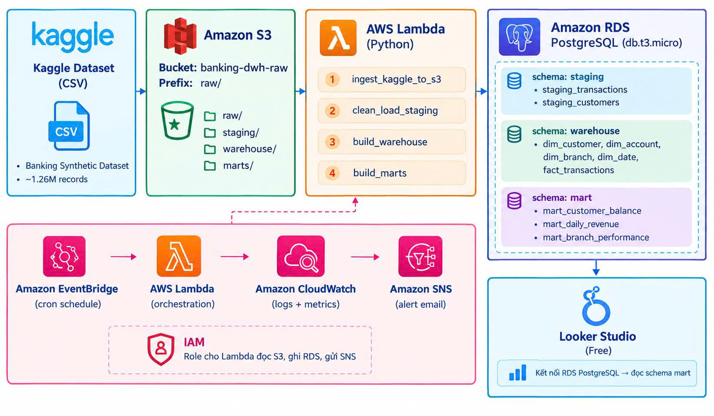

# Cloud-Based Banking Data Warehouse & Analytics Platform

Dự án Data Engineering xây dựng một hệ thống xử lý dữ liệu ngân hàng trên nền tảng AWS, sử dụng Python và PostgreSQL để chuyển đổi dữ liệu thô thành kho dữ liệu phân tích và các báo cáo phục vụ nghiệp vụ.

## Tổng quan dự án

Dữ liệu giao dịch ngân hàng có thể được sử dụng để phân tích hoạt động khách hàng, xu hướng giao dịch và hiệu suất của các chi nhánh. Tuy nhiên, dữ liệu CSV thô thường chưa đáp ứng được yêu cầu về tính nhất quán và khả năng khai thác cho mục đích báo cáo.

Dự án này xây dựng một quy trình xử lý dữ liệu trên nền tảng đám mây với các chức năng chính:

1. Thu thập bộ dữ liệu ngân hàng tổng hợp từ Kaggle.
2. Lưu trữ dữ liệu gốc trên Amazon S3.
3. Làm sạch và nạp dữ liệu vào các bảng Staging trên PostgreSQL.
4. Chuyển đổi dữ liệu Staging thành kho dữ liệu theo mô hình dữ liệu chiều.
5. Xây dựng các Data Mart phục vụ nhu cầu phân tích.
6. Trực quan hóa các chỉ số phân tích thông qua Dashboard.
7. Sử dụng các dịch vụ AWS để lập lịch, ghi nhật ký, quản lý quyền truy cập và gửi thông báo khi quy trình gặp lỗi.

## Kiến trúc hệ thống

```text
Bộ dữ liệu ngân hàng từ Kaggle (CSV)
                  |
                  v
           Amazon S3 (raw/)
                  |
                  v
              AWS Lambda
                  |
       +----------+-----------+
       |          |           |
       v          v           v
  Làm sạch &   Xây dựng    Xây dựng
  nạp Staging   Data DWH   Data Marts
       |          |           |
       +----------+-----------+
                  |
                  v
        Amazon RDS PostgreSQL
        staging / warehouse / mart
                  |
                  v
            Dashboard / BI
```

### Các dịch vụ AWS hỗ trợ

* **Amazon EventBridge:** Lập lịch và kích hoạt quy trình xử lý dữ liệu.
* **Amazon CloudWatch:** Lưu trữ nhật ký và hỗ trợ giám sát hoạt động của hệ thống.
* **Amazon SNS:** Gửi thông báo qua email khi quy trình xử lý gặp lỗi.
* **AWS IAM:** Quản lý quyền truy cập giữa các dịch vụ AWS.


## Công nghệ sử dụng

| Thành phần                     | Công nghệ                        |
| ------------------------------ | -------------------------------- |
| Nguồn dữ liệu                  | Kaggle Synthetic Banking Dataset |
| Lưu trữ dữ liệu                | Amazon S3                        |
| Xử lý dữ liệu và lập lịch      | Python, AWS Lambda, EventBridge  |
| Cơ sở dữ liệu / Data Warehouse | PostgreSQL, Amazon RDS           |
| Phân tích dữ liệu              | SQL, Python, Pandas              |
| Giám sát                       | Amazon CloudWatch                |
| Thông báo                      | Amazon SNS                       |
| Quản lý quyền truy cập         | AWS IAM                          |
| Trực quan hóa dữ liệu          | Power BI hoặc Looker Studio      |
| Quản lý mã nguồn               | Git, GitHub                      |
                
## Cấu trúc thư mục dự án

```text
aws-banking-analytics-platform/
│
├── README.md
├── .gitignore
├── .env.example
│
├── docs/
│   ├── 01_problem_statement.md
│   ├── 02_architecture.md
│   ├── 03_data_dictionary.md
│   ├── 04_developer_guide.md
│   └── diagrams/
│
├── infrastructure/
│   ├── iam_policies/
│   ├── s3_bucket_policy.json
│   └── eventbridge_rule.json
│
├── lambda/
│   ├── ingest_kaggle_to_s3/
│   ├── clean_load_staging/
│   ├── build_warehouse/
│   ├── build_marts/
│   └── alert_on_failure/
│
├── sql/
├── scripts/
├── notebooks/
├── tests/
├── dashboard/
└── data/
    └── raw/
```

## Phát triển dự án trên môi trường cục bộ

### Yêu cầu môi trường

* Python 3.11 hoặc phiên bản tương thích.
* PostgreSQL cài đặt cục bộ hoặc sử dụng dịch vụ quản lý cơ sở dữ liệu.
* Git.
* AWS CLI phục vụ triển khai lên AWS.
* Tài khoản AWS để sử dụng các thành phần chạy trên nền tảng đám mây.

### Khởi tạo dự án

```bash
git clone https://github.com/GrayNguyen-Data/aws-banking-analytics-platform.git

cd aws-banking-analytics-platform

python -m venv .venv
```

Kích hoạt môi trường ảo:

**Windows PowerShell**

```powershell
.venv\Scripts\Activate.ps1
```

**macOS / Linux**

```bash
source .venv/bin/activate
```

Cài đặt các thư viện cần thiết sau khi hoàn thiện danh sách dependencies:

```bash
pip install -r requirements.txt
```

Tạo file cấu hình môi trường từ file mẫu:

```powershell
Copy-Item .env.example .env
```

Không đưa file `.env`, thông tin đăng nhập AWS, mật khẩu cơ sở dữ liệu hoặc các bộ dữ liệu thô có dung lượng lớn lên GitHub.

## Thực thi quy trình dữ liệu

Các lệnh chạy, kiểm thử và hướng dẫn triển khai sẽ được cập nhật trong tài liệu `docs/04_developer_guide.md` trong quá trình phát triển dự án.

Tài liệu này bao gồm:

* Cài đặt môi trường phát triển.
* Khởi tạo cơ sở dữ liệu.
* Thực thi từng bước trong quy trình ETL.
* Kiểm tra chất lượng dữ liệu.
* Cấu hình và triển khai các thành phần trên AWS.
* Theo dõi nhật ký và xử lý lỗi cơ bản.
